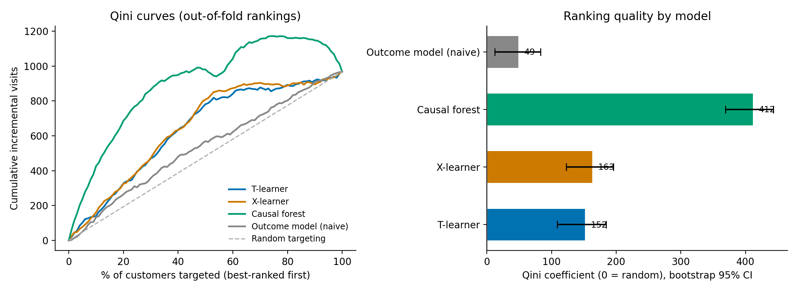
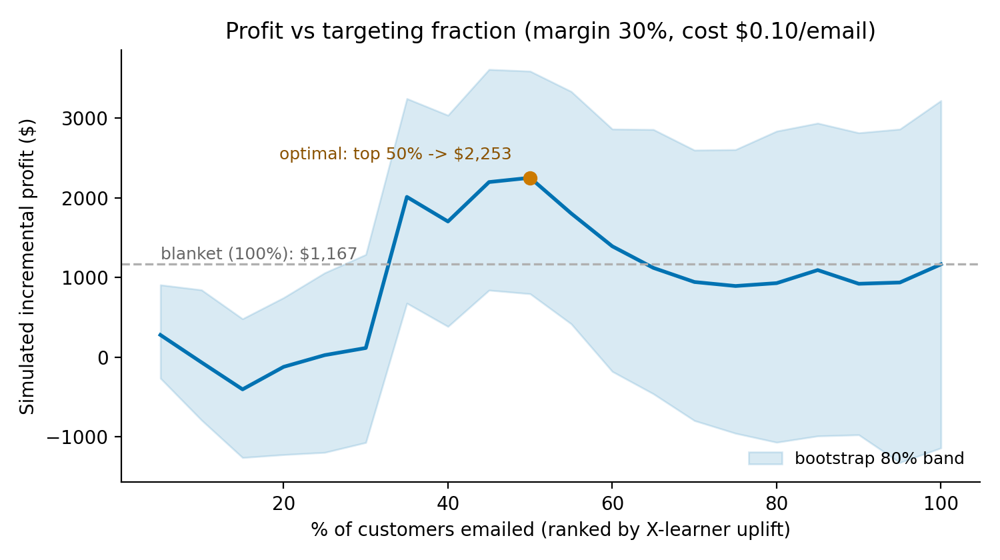

# Who should get the email? Uplift modeling on a real randomized experiment

Estimating heterogeneous treatment effects and simulating targeting policies on the
[Hillstrom MineThatData E-Mail Analytics challenge](https://blog.minethatdata.com/2008/03/minethatdata-e-mail-analytics-and-data.html)
dataset — a true randomized controlled trial on **64,000 customers** with three arms
(men's e-mail campaign / women's e-mail campaign / no-e-mail control) and two weeks of
follow-up outcomes (site visit, conversion, spend).

**The question, in ascending order of usefulness:**

1. Do the campaigns work on average? (ATE)
2. Do they work very differently for different customers? (CATE / uplift)
3. If we could only e-mail some customers, whom should we target — and what is that worth versus e-mailing everyone?

## Headline results

| | |
|---|---|
| **Average effects** | Men's e-mail: **+7.7pp** visit rate (10.6%→18.3%), **+$0.77** spend/customer. Women's: **+4.5pp**, **+$0.42**. All CIs exclude zero. |
| **Experiment validity** | No sample-ratio mismatch (χ² p≈0.95); all covariate \|SMD\| < 0.02; regression adjustment moves estimates by <0.001. |
| **Heterogeneity** | X-learner's top decile shows **7.6pp** realized uplift ≈ **1.7×** the average effect (out-of-fold). |
| **Ranking quality** | Uplift models reach Qini ≈ 151–163 vs **48** for a naive outcome-prediction ranking (~**3×**); bootstrap CIs exclude zero and the baseline. |
| **Placebo** | Permuted treatment labels → Qini ≈ 0. The pipeline does not manufacture uplift. |
| **Policy simulation** | Under stated economics (30% margin, $0.10/e-mail), optimal targeting beats blanket e-mailing by **+73% to +93%** simulated profit (T-learner: top 95%; X-learner: top 50%). |

<p align="center"></p>
<p align="center"></p>

## Why causal methods when it's already an RCT?

Randomization answers question 1 by subtraction. Questions 2–3 are *individual-level*
counterfactual questions — "how much does the e-mail change *this* customer's behavior?" —
and no individual's uplift is ever observed (each customer lives one future). CATE
estimators borrow strength across similar customers to estimate it, and the RCT is what
makes their validation honest: within any slice of a model's ranking, treated-vs-control
is still a randomized comparison, so realized uplift inside "the model's top decile" is
measurable without ground-truth labels.

## Analysis walkthrough (one notebook per stage)

| Notebook | What it does |
|---|---|
| [01 — EDA & experiment validation](notebooks/01_eda_experiment_validation.ipynb) | Data audit; **sample-ratio-mismatch** χ² test; **covariate balance** via standardized mean differences (effect sizes, not p-values — with n=64k, p-values flag trivia); ATEs with two-proportion z / Welch t inference; HC1-robust regression adjustment as a design check. |
| [02 — Subgroup heterogeneity](notebooks/02_subgroup_heterogeneity.ipynb) | Pre-registered one-dimensional subgroup ATEs with explicit multiple-comparisons caveats; motivates model-based CATE. |
| [03 — Uplift models](notebooks/03_uplift_models_oof.ipynb) | T-learner and X-learner (implemented directly on scikit-learn) plus econml's **causal forest**; intuition for when each wins; all meta-learner scores strictly **out-of-fold**. |
| [04 — Validation](notebooks/04_validation_qini.ipynb) | **Qini curves**, Qini coefficients, **uplift@k** with **bootstrap CIs**; comparison against random targeting and the naive "predict-the-outcome" baseline. |
| [05 — Policy & robustness](notebooks/05_policy_simulation_robustness.ipynb) | Profit curve under explicit margin/cost assumptions with a bootstrap band; optimal contact fraction; sensitivity to economics and to estimator choice; **placebo test**; bootstrap check of the zero-inflated spend ATE. |

Reusable, documented implementations live in [`src/`](src): experiment validation
(`validation.py`), meta-learners with OOF discipline (`models.py`), ranking metrics and
bootstrap (`evaluation.py`), policy simulation (`policy.py`).

## Reproduce

```bash
git clone https://github.com/OwenCui3/email-uplift-targeting.git
cd email-uplift-targeting
python -m venv .venv && .venv\Scripts\activate     # or: conda create -n uplift python=3.12
pip install -r requirements.txt
python -c "from src.data import download_data; download_data()"
# then run notebooks 01-05 in order (03 writes data/oof_cates.csv used by 04-05)
```

Everything is seeded (`seed=42`); reported numbers reproduce exactly.

## Limitations — read before quoting the numbers

- **Simulated policy, not a deployment.** Profit figures follow from stated margin/cost
  assumptions; the sensitivity grid in notebook 05 shows how the optimum moves with them.
- **Per-slice spend estimates are noisy** (spend is ~99% zeros, heavy-tailed): the profit
  curve carries a wide bootstrap band, and the optimal fraction is a region (~40–60% for
  the X-learner), not a point. Relatedly, an attempt to measure "incremental revenue
  captured by top-k%" was too noisy to report responsibly — flagged rather than claimed.
- **Ordering, not calibration.** Validation certifies that the CATE *ranking* concentrates
  real uplift; individual τ̂ magnitudes remain noisy estimates.
- **Bootstrap scope.** Bands capture evaluation uncertainty given trained models, not
  model-refit variance.
- **Two-week outcome window; one 2008 retail dataset.** Long-run effects (fatigue,
  cannibalization) and transportability are out of scope.
- **Multiple comparisons** in subgroup analysis are disclosed and treated as
  hypothesis-generating.

## Repo layout

```
notebooks/   narrative analysis, one per stage (run in order)
src/         importable implementations with docstrings
data/        raw + interim data (gitignored; re-download via src/data.py)
reports/     exported figures + one-page writeup
docs/        interview Q&A on the methods
```
